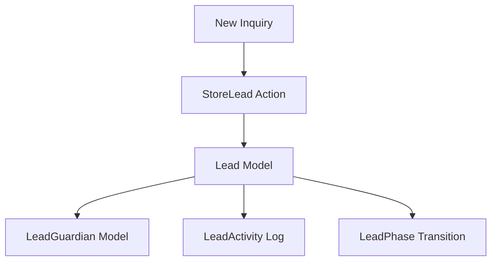
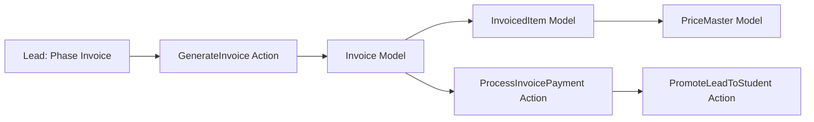
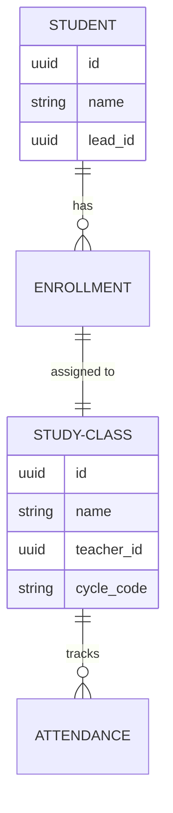

# IELC-CRM Architecture Guide

This document captures the architectural standards, patterns, and business life-cycles of the IELC-CRM project. It serves as the primary technical reference for developers and AI agents.

## 1. Core Principles

### Atomic Business Logic (Actions)
We follow the **Action Pattern**. All data-altering logic must reside in `app/Actions`.
- **Controllers**: Thin wrappers that only handle request entry and call Actions.
- **Models**: Focus on relationships and attributes (Accessors/Mutators). No business logic.
- **N+1 Prevention**: Always use `with()` or `withCount()` when fetching relationships.

### Frontend Logic Isolation (Hooks)
We strictly separate UI from Logic in React.
- **Pages**: Strictly for layout and component assembly.
- **Hooks**: Custom hooks (`resources/js/Hooks`) contain all state management and API calls.
- **UI Components**: Use the shared components in `resources/js/Components/ui` for consistency.

---

## 2. Technical Stack

- **Backend**: Laravel 12 (PHP 8.2)
- **Frontend**: React 18, Inertia.js (SSR enabled)
- **Styling**: Tailwind CSS v4
- **Real-time**: Laravel Reverb + Echo (for notifications)
- **Database**: MySQL with UUID as primary keys for core entities (`Leads`, `Invoices`, `Students`).

---

## 3. Module: CRM (Lead Acquisition)

Focuses on capturing, nurturing, and converting potential students.

### Data Flow & Entities

### Technical Specs
- **Primary Model**: `App\Models\Lead`.
- **Key Relationships**: `branch`, `owner`, `leadSource`, `leadType`, `leadPhase`, `guardians`.
- **Dashboard**: `FetchCrmDashboardData` Action provides a real-time pipeline snapshot with monthly trend comparison.
- **Automation**: Follow-up counter increments (`recordFollowUp`) and auto-resets when the lead responds (`resetFollowUp`).

---

## 4. Module: Finance (Billing & Invoicing)

Governs the conversion of a Lead into a paying customer.

### Invoicing Lifecycle

### Technical Specs
- **Primary Model**: `App\Models\Invoice`.
- **Line Items**: `App\Models\InvoicedItem` supports both `PriceMaster` (fixed fees) and manual descriptions.
- **PDF Generation**: Uses `barryvdh/laravel-dompdf` for professional invoice generation with direct tab streaming.
- **Payment Success**: Triggers three events:
  1. Marks Invoice as `paid`.
  2. Promotes Lead to **Student** status.
  3. Enrolls Student into their assigned **StudyClass**.

---

## 5. Module: Academic (Student & Class Management)

Manages active student lifecycles, attendance, and academic progress.

### Academic Relationships

### Technical Specs
- **Primary Model**: `App\Models\Student`.
- **Key Actions**:
    - `PromoteLeadToStudent`: Creates student record and transfers relevant lead data.
    - `EnrollStudent`: Links a student to a `StudyClass` for a specific scholastic period.
- **Class Cycles**: `ResetClassCycle` Action handles the transition of all classes to a new academic term.

---

## 6. Integrations & Coding Standards

### WhatsApp Integration
- **Node.js Gateway**: A separate Baileys-based server.
- **Front-end Link**: `LeadWhatsappTab.jsx` uses `WA_SERVER_URL` to communicate with the Node.js API.
- **Activity Logging**: All WA interactions are mirrored in `ActivityLog` for visibility within the CRM.

### AI Agent Rules
- **Verify before Edit**: Always check `docs/architecture.md` and `.agents/skills` first.
- **Standard Layout**: Maintain "Premium" UI patterns (consistent margins, HSL-based colors, and subtle micro-animations).
- **Communication**: Use `Inertia::render()` only with `JsonResource` collections.
