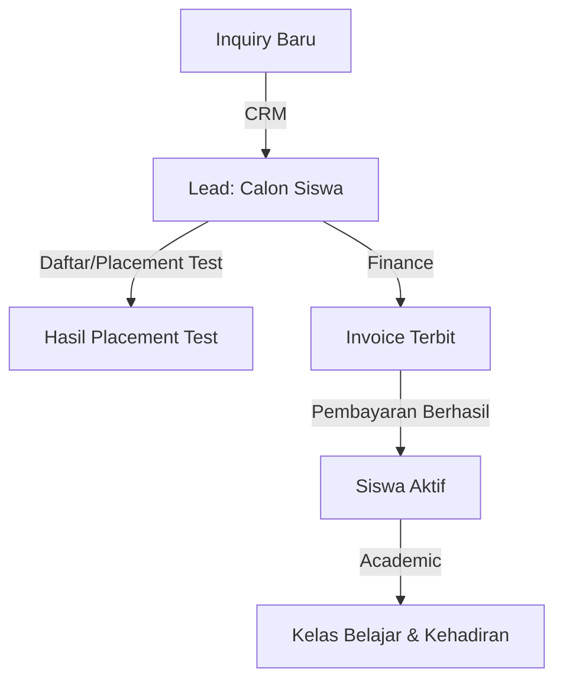

# Ringkasan Dokumentasi IELC-CRM (System Overview)

Dokumen ini memberikan rangkuman menyeluruh mengenai arsitektur, modul bisnis, skema database, aturan pengembangan, serta status terkini dari proyek IELC-CRM. Dokumen ini dibuat sebagai panduan cepat yang mudah dipahami oleh developer maupun tim teknis lainnya.

---

## 📌 1. Pendahuluan
IELC-CRM adalah sistem manajemen hubungan pelanggan (CRM) dan pengelolaan akademik yang dirancang khusus untuk lembaga kursus **IELC (Indonesia England Language Center)**. Sistem ini mencakup siklus hidup lengkap mulai dari akuisisi calon siswa (*Leads*), proses penagihan (*Finance/Invoicing*), hingga manajemen kelas dan keaktifan siswa (*Academic*).

---

## ⚡ 2. Arsitektur & Aturan Pengembangan (ADR)
Sistem dibangun dengan prinsip pemisahan logika yang ketat dan standar modern berbasis **Laravel 12 (PHP 8.2)** di backend dan **React 18 + Inertia.js** di frontend.

### Prinsip Utama & Keputusan Arsitektur (ADR)
*   **UUID sebagai Primary Key (ADR-001):** Semua tabel inti menggunakan UUID untuk keamanan agar ID urut (*sequential*) tidak terekspos ke publik.
*   **Action Pattern (ADR-002):** Logika bisnis wajib diletakkan dalam kelas aksi terisolasi di folder `app/Actions`. Controller hanya bertindak sebagai entri request (tipis) dan Model hanya mendefinisikan relasi dan atribut.
*   **Inertia.js Full-Stack (ADR-003):** Menghubungkan Laravel dan React secara langsung tanpa memerlukan REST API publik atau manajemen JWT token terpisah. Data dikirimkan menggunakan `Inertia::render()` dibantu dengan `JsonResource`.
*   **Tailwind CSS v4 (ADR-004):** Menggunakan Tailwind CSS versi 4 yang lebih cepat dan berbasis CSS native. Kustomisasi tema dilakukan di file CSS menggunakan aturan `@theme`, bukan lewat `tailwind.config.js`.
*   **Pemisahan Logika Frontend (Custom Hooks):** Logika tampilan (React Pages) harus dipisahkan dari logika bisnis frontend (state management & API call) menggunakan *Custom Hooks* yang diletakkan berdampingan (*co-located*) di folder halaman terkait (misal: `hooks/use{Entity}{Action}.js`).

---

## 🏢 3. Modul Utama & Alur Bisnis
Sistem IELC-CRM dibagi menjadi tiga modul utama yang saling terintegrasi:

### A. Modul CRM (Lead Acquisition)
Modul ini bertugas menangkap, memantau, dan membimbing calon siswa (*Leads*) hingga siap melakukan pendaftaran.
*   **Alur Data:** Inquiry Baru ➡️ Diolah via `StoreLead` ➡️ Disimpan di `leads` dengan status/fase tertentu.
*   **Fase Pipeline:** Prospek dipantau menggunakan visualisasi Kanban Board (`useKanbanBoard`).
*   **Tugas & Otomatisasi (CRM Tasks):**
    *   **Manual Tasks:** Tugas yang dibuat oleh staf untuk memantau Lead tertentu.
    *   **Follow-up Reminders (Dinamis):** Sistem mendeteksi otomatis Lead berstatus 'prospective' yang pasif (tidak ada aktivitas baru selama 4-30 hari) untuk diingatkan kembali.
    *   **Pemicu Otomatis (Cron Job):** Command background `app:check-lead-inactivity` memantau keaktifan Lead. Jika Lead tidak aktif selama tepat 4 hari, sistem membuat tugas prioritas *Medium*. Jika tidak aktif tepat 7 hari, sistem membuat tugas prioritas *High*.

### B. Modul Finance (Billing & Invoicing)
Modul ini menangani konversi Lead menjadi siswa resmi melalui transaksi keuangan yang tercatat.
*   **Siklus Invoicing:** Saat Lead menyetujui kelas, sistem membuat `Invoice` dengan item rincian (`InvoicedItem`) yang mengambil acuan harga dari `PriceMaster` (atau diisi manual).
*   **PDF Streaming:** Menggunakan pustaka `laravel-dompdf` untuk menghasilkan file PDF tagihan secara langsung.
*   **Pembayaran Berhasil:** Ketika pembayaran dikonfirmasi, sistem secara otomatis melakukan 3 aksi berantai:
    1.  Mengubah status Invoice menjadi `paid`.
    2.  Mempromosikan Lead menjadi **Siswa Aktif** (`Student`).
    3.  Mendaftarkan (*enroll*) siswa tersebut ke kelas belajar (`StudyClass`) yang dituju.

### C. Modul Academic (Student & Class Management)
Modul ini mengelola siswa aktif, penjadwalan kelas, serta rekam kehadiran.
*   **Siklus Kelas:** Kelas belajar (`StudyClass`) dibuat dengan durasi dan hari tertentu. Hook `useClassScheduleCalculation` secara otomatis menghitung perkiraan tanggal selesai sesi kelas berdasarkan tanggal mulai dan jumlah pertemuan.
*   **Transisi Periode (Reset Cycle):** Sistem menyediakan Action `ResetClassCycle` untuk mereset dan memindahkan semua kelas ke siklus akademik baru secara massal.

---

## 🗄️ 4. Ringkasan Skema Database
Database dirancang dengan integritas relasional berbasis UUID. Berikut adalah kelompok tabel penting:

1.  **Core & Master Data:**
    *   `branches` (Daftar cabang IELC)
    *   `users` & tabel profil staff terelasi (`superadmins`, `marketing`, `frontdesks`, `finance`, `teachers`)
2.  **Modul CRM & Placement Test:**
    *   `leads` (Data calon siswa) & `lead_guardians` (Data orang tua/wali)
    *   `lead_activities` (Catatan riwayat interaksi/aktivitas lead)
    *   `tasks` (Tugas follow-up staf)
    *   `pt_exams`, `pt_questions`, `pt_sessions`, `pt_answers` (Sistem ujian placement test online untuk calon siswa)
3.  **Modul Finance & Academic:**
    *   `price_masters` (Katalog harga per sesi)
    *   `invoices` & `invoiced_items` (Tagihan & item rincian)
    *   `students` (Data siswa aktif)
    *   `study_classes` & `study_class_student` (Kelas & data siswa yang terdaftar di dalamnya)

---

## 🔐 5. Role-Based Access Control (RBAC)
Sistem menggunakan **Spatie Laravel Permission** untuk mengamankan hak akses fitur.

### Matriks Peran (Role) & Hak Akses
*   **Superadmin:** Memiliki kendali penuh atas seluruh sistem, manajemen pengguna, cabang, dan pengaturan aplikasi.
*   **Frontdesk (Operasional Harian):**
    *   **CRM:** Mengelola lead (view, create, update, delete, followup), mengubah fase pipeline, mengelola registrasi mandiri publik.
    *   **Academic:** Melihat daftar kelas, membuat/mengedit/menghapus kelas, melihat data siswa aktif.
    *   **Master:** Mengelola template chat WhatsApp dan media assets.
*   **Marketing (Finance Operations):**
    *   **Finance:** Mengelola invoice (view, create sebelum paid, update) serta memproses/mengonfirmasi pembayaran.
    *   **CRM & Academic:** Memiliki akses baca saja (*read-only*) ke data lead dan siswa aktif untuk kebutuhan referensi pembuatan invoice.

*Catatan: Role `finance` dan `teacher` sudah terdaftar di database namun cakupan permission detailnya masih dalam tahap perencanaan.*

---

## 💬 6. Integrasi WhatsApp Gateway (WA-Baileys)
Untuk mempermudah komunikasi dengan calon siswa, sistem terhubung ke layanan WhatsApp Gateway terpisah.
*   **Teknologi:** Server Node.js mandiri menggunakan pustaka **Baileys** yang terhubung dengan database SQLite lokal di server gateway tersebut.
*   **Cara Kerja:** Laravel berkomunikasi dengan gateway melalui HTTP request menggunakan token autentikasi di header (`x-api-key`) ke alamat VPS yang ditentukan di konfigurasi env `WA_SERVER_URL`.
*   **Fitur API:**
    *   Cek status koneksi WA dan ambil gambar QR Code jika perlu menghubungkan ulang device (`GET /api/wa-status/:branch`).
    *   Mengambil riwayat chat (50 pesan terakhir) untuk ditampilkan langsung di CRM dashboard (`GET /api/chat-history/:branch/:phone`).
    *   Kirim pesan teks otomatis/manual ke calon siswa (`POST /api/send-message`).
*   **Sinkronisasi Log:** Semua aktivitas chat otomatis terekam di dalam `lead_activities` (Activity Log) agar tim dapat memantau history interaksi pelanggan secara transparan.

---

## 🎨 7. Panduan Komponen UI (Frontend)
Untuk menjaga konsistensi tampilan premium, developer wajib menggunakan pustaka komponen bersama yang telah disediakan di `resources/js/Components/`:

*   **Komponen Utama Halaman:** `AdminPageLayout` & `AdminCard` (panel berbingkai tipis dengan bayangan lembut).
*   **Tampilan Data & Detail:** `DataTable` (mendukung pagination server-side & client-side), `Tabs` (untuk navigasi tab), dan `SlideOver` (panel detail geser dari kanan).
*   **Formulir & Pilihan:** `Modal` (pop-up form), `Select` (pilihan standar), `PremiumSearchableSelect` (combobox dengan fitur pencarian untuk data dalam jumlah besar), `DatePicker` (kalender pilihan tanggal), dan `PrimaryButton`/`SecondaryButton`.
*   **Notifikasi & Label:** `Badge` (melabeli status dengan warna otomatis berdasarkan kata kunci seperti *Paid/Active/Pending/Overdue*) dan `Toast` (flash message yang sudah terpasang global di layout utama).

---

## 📈 8. Status Proyek & Rencana Kerja (Backlog)
Berdasarkan pembaharuan status proyek per **2026-04-08**:

### Status Fitur Saat Ini
*   **Selesai (Done):** Modul CRM (Backend Actions & Frontend Kanban/List selesai), Modul Master Data (CRUD lengkap), Modul Auth.
*   **Sedang Berjalan (In Progress):** Modul Finance Frontend (Invoice index & Price master), Halaman Pendaftaran Publik (Self-registration form).
*   **Belum Dimulai (Backlog/Planned):**
    *   Penyempurnaan Action Update & Delete Lead.
    *   Implementasi `RolePermissionSeeder` dan middleware hak akses RBAC di route Laravel.
    *   Pembuatan modul penayangan laporan & analitik akademik.
    *   Halaman detail profil Siswa secara mendalam (*Student Detail Page*).
